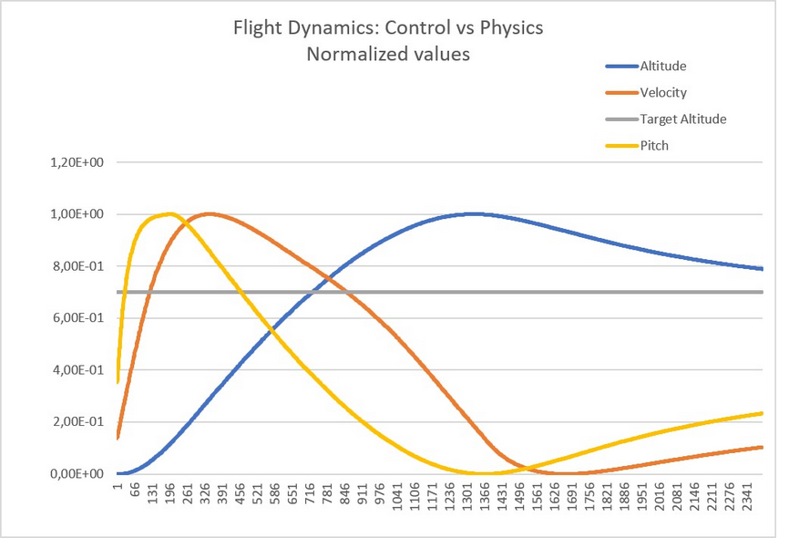
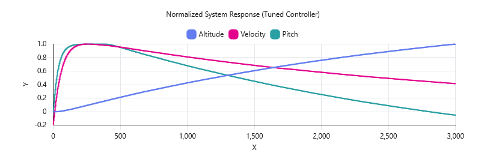

# Flight Physics and Control System in Ada

## Overview

This project implements a simplified vertical flight model together with a multi-loop control system in Ada.

The goal is to explore how control systems interact with physical dynamics, not just simulate motion.

---

## System Architecture

The controller is composed of three loops:

### Outer Loop (Altitude to Pitch)
- Computes altitude error
- Generates desired pitch command

### Inner Loop (Pitch to Elevator)
- Uses PD control
- Tracks desired pitch
- Outputs elevator command

### Energy Loop (Altitude to Throttle)
- Uses PI control
- Regulates system energy
- Eliminates steady-state error
- Includes velocity damping

---

## Control Chain

Elevator -> Pitch -> Velocity -> Altitude

This shows how control inputs propagate through the system.

---

## Visualization

Simulation data is logged and plotted.

Since variables have very different magnitudes:
- Altitude up to about 1400
- Pitch roughly between -20 and 20
- Velocity smaller scale

All values are normalized so they can be shown together.

---

## Example Plot

---

## Observed Behavior (Physics Demonstration)

The plot above is intentionally chosen to show the interaction between control and physics.

Observed:

- Pitch decreases first (descent command)
- Velocity decreases afterward
- Altitude continues increasing for some time

This happens because of accumulated kinetic energy.

Even when the controller commands descent, the system cannot instantly change position.

---

## Tuned Controller

The controller gains have already been tuned and are included in this repository.

With the tuned system:
- Overshoot is minimal
- Convergence is smooth
- Energy is reduced early
- The system remains stable

## Important Note

The plot shown above is NOT the final tuned response.

It was intentionally selected because it better illustrates the physical behavior of the system.

The current controller implementation in this repository uses tuned gains that result in minimal overshoot, and is shown bellow.

## Example Plot

---

## Key Insight

Control does not act directly on position, but on acceleration.

Because of this:
- Velocity must first decrease
- Only afterward does altitude stabilize

This introduces a delay between control action and system response.

---

## Project Structure

physics        - aircraft dynamics  
pid_control    - controller implementation  
display        - real-time visualization  
utils          - helper functions  
logs           - simulation outputs  
images         - plots  

---

## Project Goals

- Explore multi-loop control systems
- Understand interaction between control and physics
- Visualize system behavior
- Tune and improve controller response

---

## Current Status

- Multi-loop controller implemented
- Energy control (throttle) added
- Gains tuned for stable behavior
- Logging and visualization working