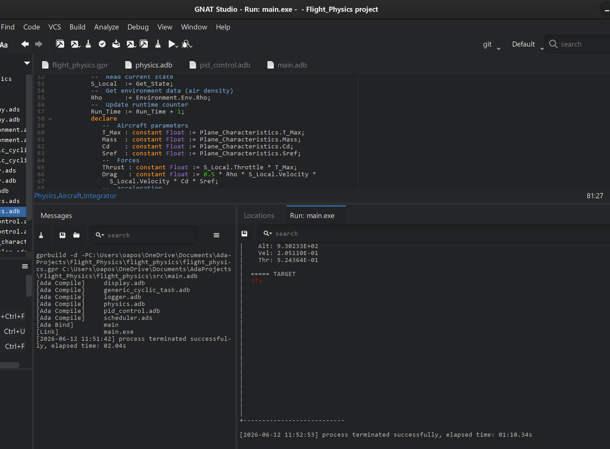

# Flight Control Simulation (Ada)

This project implements a simplified vertical flight control system using a PID controller and a physics-based model.

## Overview

The system simulates aircraft altitude control using:

- Physics-based vertical motion (thrust, drag, gravity)
- PID controller with velocity damping and anti-windup
- Task-based cyclic execution using Ada
- ASCII visualization in the terminal
- CSV logging for analysis

---

## Simulation Output



---

## Architecture

The system is divided into modular packages:

- **Physics**
  Aircraft state and motion integration

- **PID_Control**
  Computes throttle based on error, velocity, and integral action

- **Environment**
  Provides atmospheric parameters (air density) and is designed for extensions (wind, altitude effects)

- **Display**
  ASCII-based visualization of the aircraft and target altitude

- **Logger**
  Logs simulation data (position, velocity, throttle) to CSV

- **Scheduler**
  Coordinates periodic execution via cyclic tasks

---

## Execution Model

The simulation is driven by periodic tasks instantiated during elaboration:

- Physics integrator (fixed time step)
- PID control loop
- Environment update
- Data logging
- Display rendering


---

## Features

- PID controller with:
  - Proportional term (position error)
  - Integral term with anti-windup
  - Derivative action using velocity (damping)

- Modular architecture using Ada packages
- Protected objects for safe shared state access
- Real-time ASCII visualization
- CSV logging for external analysis

---

## Control Tuning

Simulation data is recorded to CSV logs and used to tune PID parameters.

By analyzing position, velocity, and throttle over time, the controller gains
(Kp, Ki, Kd) were adjusted to improve stability, reduce overshoot, and achieve
a realistic response.

---

## Build & Run

Build using GNAT Studio or:

```bash
gprbuild flight_physics.gpr
./main
